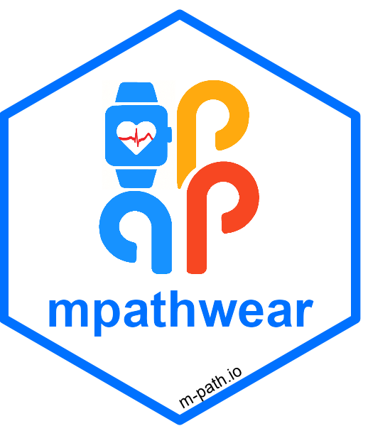

<!-- README.md is generated from README.Rmd. Please edit that file -->

```{r, include = FALSE}
knitr::opts_chunk$set(
  collapse = TRUE,
  comment = "#>",
  fig.path = "man/figures/README-",
  out.width = "100%"
)
```

# mpathwear <a href='https://koenniem.github.io/mpathwear/index.html'></a>

<!-- badges: start -->
[](https://lifecycle.r-lib.org/articles/stages.html#experimental)
[](https://github.com/koenniem/mpathwear/actions/workflows/R-CMD-check.yaml)
<!-- badges: end -->

NOTE: This package is highly experimental and still in early development. 

The goal of mpathwear is to help users import wearable data gathered through m-Path. Importantly, it helps unpack the exported CSV file from m-Path and neatly sorts it into intraday and daily data where the measurement IDs are converted to a human readable format.

## Installation

You can install the development version of mpathwear from Github:

```{r, eval = FALSE}
remotes::install_github("koenniem/mpathwear")
```

# Reference 
For an overview of all functions in this package, see the [mpathwear Reference Site](https://koenniem.github.io/mpathwear/). For other m-Path related data, see [mpathr](https://github.com/m-path-io/mpathr) for regular m-Path questionnaire data, and [mpathsenser](https://github.com/koenniem/mpathsenser) for m-Path sensor data.

## Getting help
If you encounter a clear bug or need help getting a function to run, please file an issue with a minimal reproducible example on [Github](https://github.com/koenniem/mpathwear/issues).

## Code of Conduct

Please note that the mpathwear project is released with a [Contributor Code of Conduct](https://contributor-covenant.org/version/2/1/CODE_OF_CONDUCT.html). By contributing to this project, you agree to abide by its terms.

