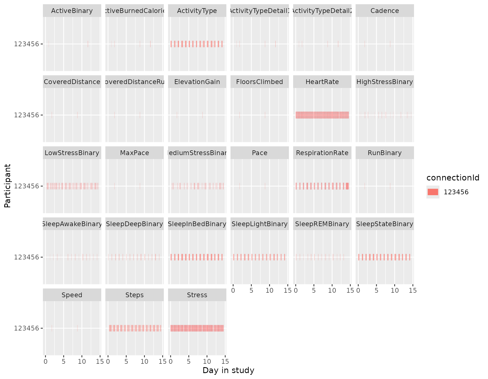
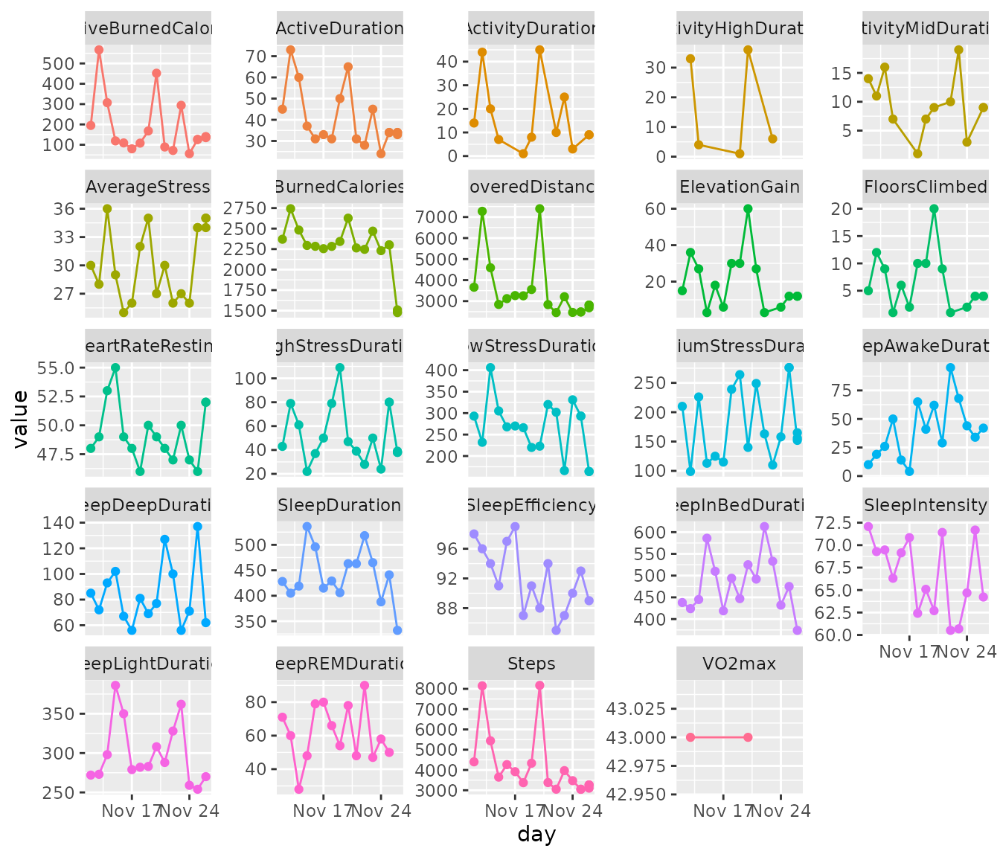
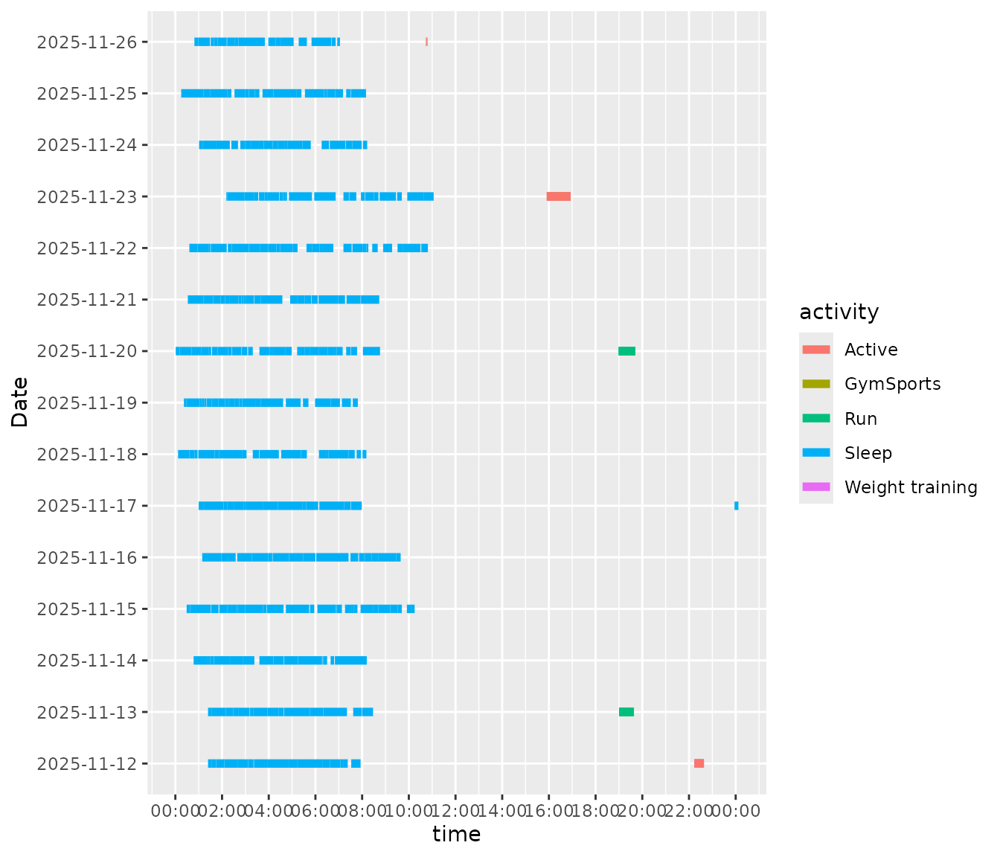
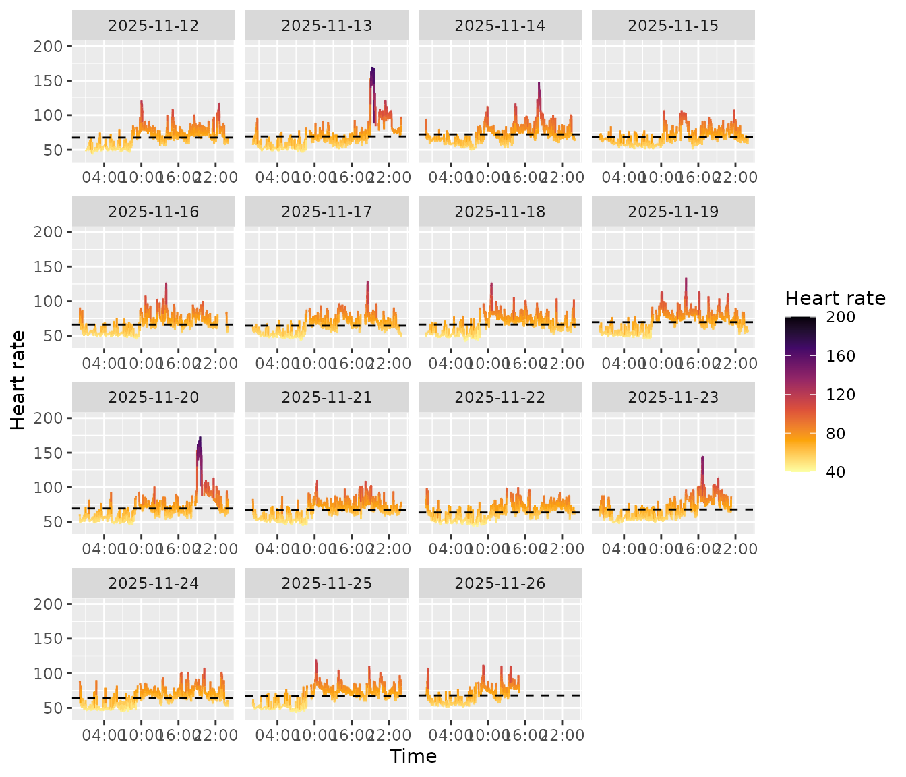
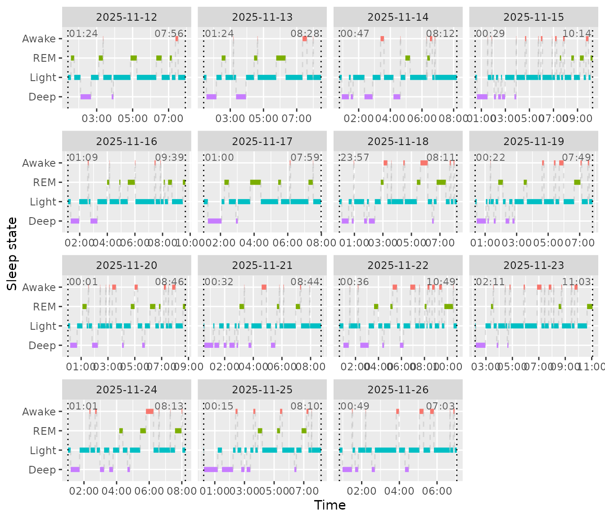

# Get started

**Installing**

You can install `mpathwear` from Github.

``` r
remotes::install_github("koenniem/mpathwear")
```

Let’s load some libraries we will use for this vignette.

``` r
library(dplyr)
#> 
#> Attaching package: 'dplyr'
#> The following objects are masked from 'package:stats':
#> 
#>     filter, lag
#> The following objects are masked from 'package:base':
#> 
#>     intersect, setdiff, setequal, union
library(mpathwear)
```

## Overview

This vignette shows a minimal workflow for using the `mpathwear`
package. In this vignette, we will use the example data included with
the package. This example dataset was downloaded directly from m-Path
(see the
[manual](https://manual.m-path.io/knowledge-base/wearables/#4-exporting-wearable-data)
for how to download the data) and should thus be very similar to a
dataset from a real study.

First, we will set a `path` variable that points to the data, in this
case from within `mpathwear`:

``` r
# Path to the example data shipped with the package
path <- system.file("extdata", "example.csv", package = "mpathwear")
```

Next, we can use the
[`read_mpathwear()`](https://koenniem.github.io/mpathwear/reference/read_mpathwear.md)
function to read the data into R.

Note that if you downloaded the data iteratively from m-Path (e.g. every
day to have backups), the data will overlap as the data export in m-Path
is cumulative. Nevertheless,
[`read_mpathwear()`](https://koenniem.github.io/mpathwear/reference/read_mpathwear.md)
will automatically remove duplicate rows but this will fail if a day was
not yet completed.

``` r
# Read the data (this can also be a directory containing multiple exported CSVs)
raw <- read_mpathwear(path)

head(raw)
#> # A tibble: 3 × 9
#>   connectionId legacyCode  code     alias initials accountCode lastCreatedAtUnix
#>   <chr>        <chr>       <chr>    <chr> <chr>    <chr>                   <dbl>
#> 1 123456       !1234@abc12 !abcd e… exam… exa      abc12           1764164955448
#> 2 123456       !1234@abc12 !abcd e… exam… exa      abc12           1764165350362
#> 3 123456       !1234@abc12 !abcd e… exam… exa      abc12           1764166043493
#> # ℹ 2 more variables: dynamicData <list>, dailyData <list>
```

## Cleaning the data

[`read_mpathwear()`](https://koenniem.github.io/mpathwear/reference/read_mpathwear.md)
returns the raw exported rows containing JSON-encoded daily and dynamic
measurements. The functions
[`clean_daily_data()`](https://koenniem.github.io/mpathwear/reference/clean_daily_data.md)
and
[`clean_dynamic_data()`](https://koenniem.github.io/mpathwear/reference/clean_dynamic_data.md)
unpack these JSON blobs and return tidy tibbles suitable for plotting
and analysis.

``` r
# Clean interday (daily) summary data
# Drop the dynamicData column since this cannot be combined with daily data anyway
daily <- raw |> 
  select(-"dynamicData") |>
  clean_daily_data()

glimpse(daily)
#> Rows: 387
#> Columns: 18
#> $ connectionId      <chr> "123456", "123456", "123456", "123456", "123456", "1…
#> $ legacyCode        <chr> "!1234@abc12", "!1234@abc12", "!1234@abc12", "!1234@…
#> $ code              <chr> "!abcd efgh", "!abcd efgh", "!abcd efgh", "!abcd efg…
#> $ alias             <chr> "example_user", "example_user", "example_user", "exa…
#> $ initials          <chr> "exa", "exa", "exa", "exa", "exa", "exa", "exa", "ex…
#> $ accountCode       <chr> "abc12", "abc12", "abc12", "abc12", "abc12", "abc12"…
#> $ lastCreatedAtUnix <dbl> 1.764165e+12, 1.764165e+12, 1.764165e+12, 1.764165e+…
#> $ day               <date> 2025-11-12, 2025-11-12, 2025-11-12, 2025-11-12, 202…
#> $ category          <chr> "Activity", "Activity", "Activity", "Activity", "Act…
#> $ subcategory       <chr> "Steps", "CoveredDistance", "FloorsClimbed", "Elevat…
#> $ variable          <chr> "Steps", "CoveredDistance", "FloorsClimbed", "Elevat…
#> $ value             <chr> "4402", "3661.0", "5", "15.0", "2370", "195", "14", …
#> $ timezoneOffset    <int> 60, 60, 60, 60, 60, 60, 60, 60, 60, 60, 60, 60, 60, …
#> $ generation        <chr> NA, NA, NA, "calculation", NA, NA, "calculation", NA…
#> $ created_at        <dttm> 2025-11-26 13:48:37, 2025-11-26 13:48:37, 2025-11-2…
#> $ data_source       <chr> "Garmin", "Garmin", "Garmin", "Garmin", "Garmin", "G…
#> $ description       <chr> "sum of steps (including the manually added values)"…
#> $ available_sources <list> <"Apple", "Beurer", "Decathlon", "Fitbit", "Garmin"…
```

For larger datasets,
[`clean_dynamic_data()`](https://koenniem.github.io/mpathwear/reference/clean_dynamic_data.md)
may take some time to finish running (e.g. several) minutes.

``` r
# Clean intraday (dynamic) data
# Drop the dailyData column since this cannot be combined with dynamic data anyway
dynamic <- raw |> 
  select(-"dailyData") |> 
  clean_dynamic_data()

glimpse(dynamic)
#> Rows: 37,332
#> Columns: 19
#> $ connectionId      <chr> "123456", "123456", "123456", "123456", "123456", "1…
#> $ legacyCode        <chr> "!1234@abc12", "!1234@abc12", "!1234@abc12", "!1234@…
#> $ code              <chr> "!abcd efgh", "!abcd efgh", "!abcd efgh", "!abcd efg…
#> $ alias             <chr> "example_user", "example_user", "example_user", "exa…
#> $ initials          <chr> "exa", "exa", "exa", "exa", "exa", "exa", "exa", "ex…
#> $ accountCode       <chr> "abc12", "abc12", "abc12", "abc12", "abc12", "abc12"…
#> $ lastCreatedAtUnix <dbl> 1.764165e+12, 1.764165e+12, 1.764165e+12, 1.764165e+…
#> $ start_time        <dttm> 2025-11-23 11:36:00, 2025-11-12 09:11:15, 2025-11-2…
#> $ end_time          <dttm> 2025-11-23 11:39:00, 2025-11-12 09:12:15, 2025-11-2…
#> $ category          <chr> "Stress", "Cardiovascular", "Sleep", "Activity", "Ca…
#> $ subcategory       <chr> "Stress", "HeartRate", "SleepInBedDuration", "Steps"…
#> $ variable          <chr> "Stress", "HeartRate", "SleepInBedBinary", "Steps", …
#> $ value             <chr> "27", "82", "true", "14.0", "68", "54", "25", "true"…
#> $ tz_offset         <int> 60, 60, 60, 60, 60, 60, 60, 60, 60, 60, 60, 60, 60, …
#> $ generation        <chr> NA, NA, "automated_measurement", "automated_measurem…
#> $ created_at        <dttm> 2025-11-26 13:48:37, 2025-11-26 13:48:37, 2025-11-2…
#> $ data_source       <chr> "Garmin", "Garmin", "Garmin", "Garmin", "Garmin", "G…
#> $ description       <chr> "stress measured during that period scaling from 0 t…
#> $ available_sources <list> "Garmin", <"Apple", "Beurer", "Fitbit", "Garmin", "…
```

## Example charts

Below are a few example charts that demonstrate common visualizations
for wearable data. For an overview of all charting functions, see the
[reference section](https://koenniem.github.io/mpathwear/reference).

### Coverage

First of all, we may want to know to what extent data was actually
gathered. We can inspect this using a coverage chart that plots whether
data was present or absent over time. For the daily data, we can use
[`daily_coverage_chart()`](https://koenniem.github.io/mpathwear/reference/daily_coverage_chart.md)
that plots each participant ID on the y-axis and day number (`0` for day
1, `1` for day 2 etc.) on the x-axis with variables displayed as facets.
This gives a good indication of how complete the data is.

Note that not necessarily all variables will be present for all days.
First of all, some devices may not support some variables which means
that they will always be absent. Second, some variables are not
continuous but rather event-driven. For instance, if there was no high
activity event on a certain day, the `ActivityHighDuration` will be
absent. In a way, this is an implicit `0` that you may want to take into
account when running analyses.

``` r
daily_coverage_chart(daily)
```


We can do the same thing for the intraday data using
[`coverage_chart()`](https://koenniem.github.io/mpathwear/reference/coverage_chart.md),
only here are the bars not per day but rather displayed by their actual
duration. So, while the daily coverage chart shows you whether data is
present or not for that day, the intradaily coverage chart shows exactly
how often data is collected across time spans.

Like the daily coverage chart, “missing” data does not need to be truly
missing. For instance, `RunBinary` does not occur if the participant did
not run during the recorded period. On the other hand, one would hope
that `HeartRate` is somewhat continuously present. In conclusion, this
chart shows you how often data is present for each variable over time.

``` r
coverage_chart(dynamic)
```



### Daily summary chart

The
[`daily_chart()`](https://koenniem.github.io/mpathwear/reference/daily_chart.md)
function visualizes daily summary variables over time for a single
participant. Each variable is plotted in its own facet.

``` r
daily_chart(daily)
```



### Activity timeline

Show activity types across days using
[`activity_chart()`](https://koenniem.github.io/mpathwear/reference/activity_chart.md).

``` r
activity_chart(dynamic)
```



### Heart rate

[`heart_rate_chart()`](https://koenniem.github.io/mpathwear/reference/heart_rate_chart.md)
shows the heart rate over time as well as the average heart rate of that
day.

``` r
heart_rate_chart(dynamic)
#> Warning: Removed 1 row containing missing values or values outside the scale range
#> (`geom_segment()`).
```



## Sleep

The package includes helpers for sleep visualisation and commonly used
sleep metrics. The
[`sleep_chart()`](https://koenniem.github.io/mpathwear/reference/sleep_chart.md)
function visualises sleep stages (awake, REM, light, deep) across
nights. The other helpers compute durations and scores from intraday
(dynamic) data.

``` r
sleep_chart(dynamic)
```



Below we show a few of the sleep metric helpers. Each returns a tibble
with `day` and the corresponding metric (in seconds for intraday-derived
metrics). To merge them, we can use
[`Reduce()`](https://rdrr.io/r/base/funprog.html) to call each function
and add them to the result using
[`full_join()`](https://dplyr.tidyverse.org/reference/mutate-joins.html).

``` r
Reduce(
  \(x, y) full_join(x, y, by = "day"),
  list(
    sleep_duration(dynamic),
    sleep_deep_duration(dynamic),
    sleep_efficiency(dynamic)
  )
)
#> # A tibble: 15 × 4
#>    day        SleepDuration SleepDeepDuration SleepEfficiency
#>    <date>             <int>             <int>           <dbl>
#>  1 2025-11-12         23520              2460           0.974
#>  2 2025-11-13         25440              4320           0.955
#>  3 2025-11-14         26700              5580           0.942
#>  4 2025-11-15         35158              6120           0.915
#>  5 2025-11-16         30600              4020           0.973
#>  6 2025-11-17         25140              3360           0.990
#>  7 2025-11-18         29640              4860           0.868
#>  8 2025-11-19         26820              4140           0.908
#>  9 2025-11-20         31500              4620           0.882
#> 10 2025-11-21         29520              7620           0.941
#> 11 2025-11-22         36780              6000           0.845
#> 12 2025-11-23         31971              3360           0.872
#> 13 2025-11-24         25920              4260           0.898
#> 14 2025-11-25         28500              8220           0.928
#> 15 2025-11-26         22440              3720           0.888
```
